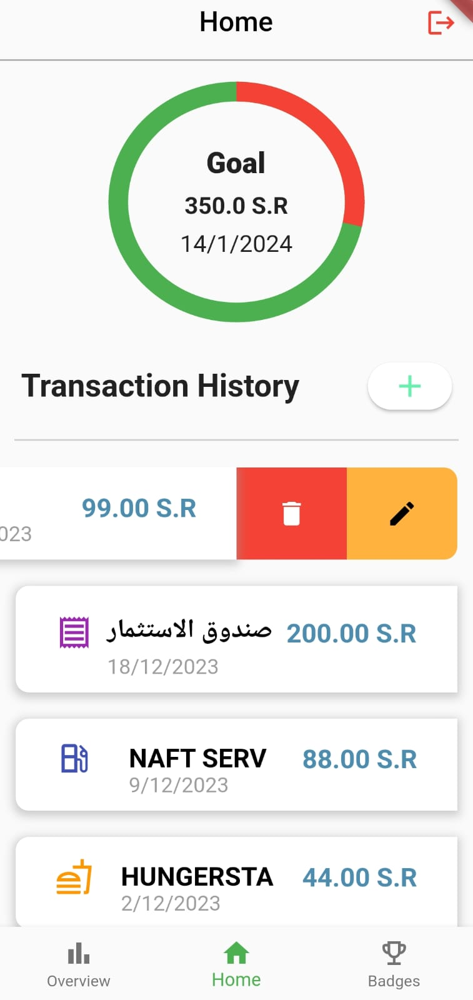
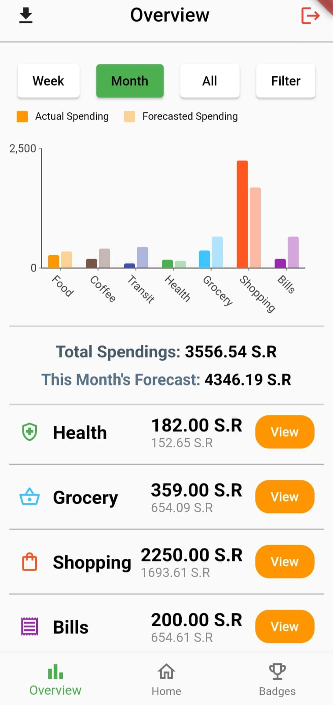
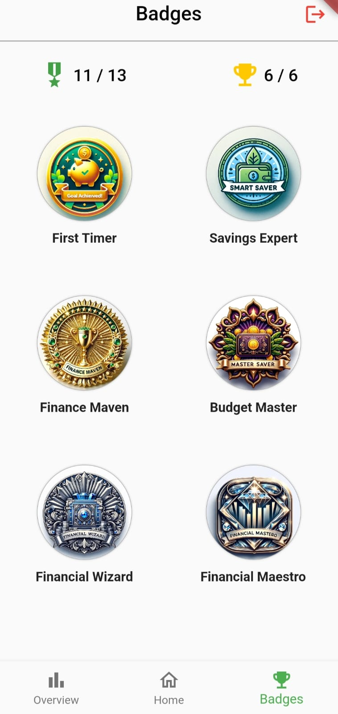

# Expense Tracker Application
Expense Tracking mobile app created with flutter, uses realmDB with atlas device sync to sync users data to a mongoDB cluster on the cloud.  
The application leverages the power of Machine Learning to help classify each transaction before adding it, and also provides monthly spending forecast.

## Features
- Automated categorization and addition of transactions.
- Forecasting Expenditure.
- Exporting Expenditure to CSV.
- Gamification.
- Setting and tracking goals.

## Results

    
    
<i><b>Home Page</b></i>

 

    
    
<i><b>Overview Page</b></i>

 

    
    
<i><b>Badges Page</b></i>

## Footnotes
Special thanks to:
1. [Dr. Khalid Alharbi](https://github.com/kalharbi)
2. [Emad Felemban](https://github.com/EmadsHub)
3. [Abdulhamid Al-Ghamdi](https://github.com/abusaeed17)
   
for helping, assisting, and working with me on this project
